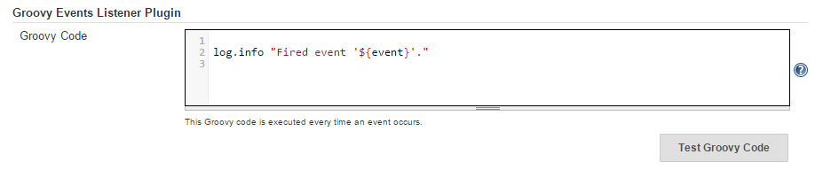

[](https://wiki.jenkins-ci.org/display/JENKINS/Groovy+Events+Listener+Plugin) [](https://jenkins.ci.cloudbees.com/job/plugins/job/groovy-events-listener-plugin/) [](https://www.versioneye.com/user/projects/56df737adf573d00352c67e3) [](https://codecov.io/github/nickgrealy/global-events?branch=master) [](https://gitter.im/jenkinsci/groovy-events-listener-plugin?utm_source=badge&utm_medium=badge&utm_campaign=pr-badge&utm_content=badge)

# Groovy Events Listener Plugin

A Jenkins plugin, which executes groovy code when an event occurs.

Table of contents
---

1. [Overview](#overview)
1. [Building](#building)
1. [Basic Usage](#basic-usage)
1. [Authors](#authors)
1. [License](#license)
1. [Similar Plugins](#similar-plugins)
1. [Release Notes](/jenkinsci/groovy-events-listener-plugin/milestones?state=closed)
1. [Bugs/Issues/Enhancements](/jenkinsci/groovy-events-listener-plugin/issues)

Overview
---

The reason I created the plugin was because I wanted to integrate Jenkins with an external application.
Invoking a Jenkins jobs via the REST api was simple, but getting Jenkins to callback the external application wasn't
straight forward.

All the plugins I'd seen either had to be individually configured per job (i.e. in a post build step), or their features
were limited to making a HTTP GET/POST request (a bit restrictive).

Bascially:

- I wanted to be able to write my own code
- I didn't want to repeat myself

So I wrote this plugin. Along the way, I realised it could have some other applications too:

- customised logging
- performance monitoring
- incident escalation
- integration with 3rd party applications
- ???

Building
---

Prerequisites:

- JDK 6 (or above)

To setup for use with Intellij IDEA

```Shell
./gradlew cleanIdea idea
```

To run Jenkins ([http://localhost:8080](http://localhost:8080)) locally with the plugin installed:

```Shell
./gradlew clean server
```

To build the Jenkins plugin (.jpi) file:

```Shell
./gradlew clean jpi
```

To publish/release the Jenkins plugin:

1. Update the `version` in `gradle.properties`, to remove "-SNAPSHOT" (increment and re-add after publishing)

```Shell
./gradlew clean publish
```

Basic Usage
---

To get started:

1. Install the plugin (or [run Jenkins locally](#building))
1. Navigate to the *Jenkins > Manage Jenkins > Configuration* page
1. You should now see a *Global Events Plugin* section (similar to the following screenshot).



This plugin executes the supplied Groovy code, every time an event is triggered.

So lets get started with the simplest example.

```Groovy
log.info "hello world!"
```

Now save the changes, kick off a Jenkins job, and you will see "hello world!" written to the logs three times. Alternatively, 
there's now a `Test Groovy Code` button, which will execute the code with the `event`=`RunListener.onStarted`.

The plugin actually injects a couple of variables, which you can use in your code. Here's some examples using the `event`
and `env` variables.

This code limits the logging to only occur when a Job is completed!

```Groovy
if (event == 'RunListener.onFinalized'){
    log.info "hello world!"
}
```

And this one filters on Job's whose name starts with "Foobar"...

```Groovy
if (env.JOB_NAME.startsWith('Foobar')){
    log.info "hello world!"
}
```

There's also a `context` Map variable. You can add your own variables to this Map, by returning a Map from your code.
E.g.

```Groovy
if (event == 'RunListener.onFinalized'){
    def newCount = (context.finishCount ?: 0) + 1
    log.info "hello world! finishCount=$newCount"
    return ["finishCount": newCount]
}
```

This will keep a record in memory, of how many times Jobs have finished. You can also achieve the same result, by
adding variables directly to the Map variable... e.g.

```Groovy
if (event == 'RunListener.onFinalized'){
    context.finishCount = (context.finishCount ?: 0) + 1
    log.info "hello world! finishCount=${context.finishCount}"
}
```

You can also use `@Grab` annotations ([only where they are valid](https://issues.apache.org/jira/browse/GROOVY-6069))
if you'd like to import external dependencies (thanks [Daniel](https://github.com/CoreMedia/job-dsl-plugin/commit/830fae7a0fd8a046c620600e46633166804190e3)
for your solution!).

```Groovy
@Grab('commons-lang:commons-lang:2.4')
import org.apache.commons.lang.WordUtils
log.info "Hello ${WordUtils.capitalize('world')}!"
```

Not bad! And finally, you can import groovy scripts, so you can hide away some of the heavy lifting... here I'm using 
a [RestClient.groovy](src/main/site/includes/RestClient.groovy) script.

```Groovy
def client = evaluate(new File('../includes/RestClient.groovy'))

def resp = client.post('http://localhost:9200/jenkins/runInstances', [
        jobName       : env.JOB_NAME,
        jobDuration   : run.duration,
        jobResult     : run.result.toString(),
        jobBuildNumber: run.number,
        jobTimestamp  : run.timestamp.timeInMillis,
])
assert resp.status == 201
```

You can pretty much do what ever you want from here... custom logging to a file, sending performance metrics to
an elastic server, sending email or messenger notifications, calling a SOAP service... the world's your oyster. If 
you've got something cool that you want to share, let me know and I'll add it to the [examples](src/main/site/examples)!

For more details on which events trigger the code, what variables are available and details on configuring logging,
please see the [plugin's help file](https://cdn.rawgit.com/nickgrealy/global-events/master/src/main/resources/org/jenkinsci/plugins/globalEventsPlugin/GlobalEventsPlugin/help-onEventGroovyCode.html).

Authors
---

Nick Grealy - <nickgrealy@gmail.com>

License
---

Licensed under the [MIT License (MIT)](LICENSE)

Similar Plugins
---

These plugins have similar (but different) functionality:

- [https://wiki.jenkins-ci.org/display/JENKINS/Notification+Plugin](https://wiki.jenkins-ci.org/display/JENKINS/Notification+Plugin)
- [https://wiki.jenkins-ci.org/display/JENKINS/Extreme+Notification+Plugin](https://wiki.jenkins-ci.org/display/JENKINS/Extreme+Notification+Plugin)
- [https://github.com/speedledger/elasticsearch-jenkins](https://github.com/speedledger/elasticsearch-jenkins)
- [https://github.com/jenkinsci/post-completed-build-result-plugin](https://github.com/jenkinsci/post-completed-build-result-plugin)